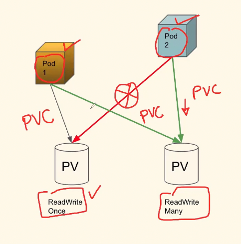

## How is your K8's setup done on AWS? Please explain?

Answer:

## A pod is trying to access a volume but it gives access error. We would like this pod to have access to this volume. What can we do to achieve this?

Answer:

### 1.   The issue could be coming because of AccessModes of volume

-   Not all PVs allow multiple pod access.

-   In K8s
    -   ReadWriteOnce
    -   ReadOnlyMany
    -   ReadWriteMany
    -   ReadWriteOncePod

-   Example:
    -   NFS supports ReadWriteMany
    -   EBS only support ReadWriteOnce

### 2. Could be typo (human error) in PVC when mentioning PV

### 3. PV might not have enough space requested by the PVC
-   use `kubectl describe` to identify
