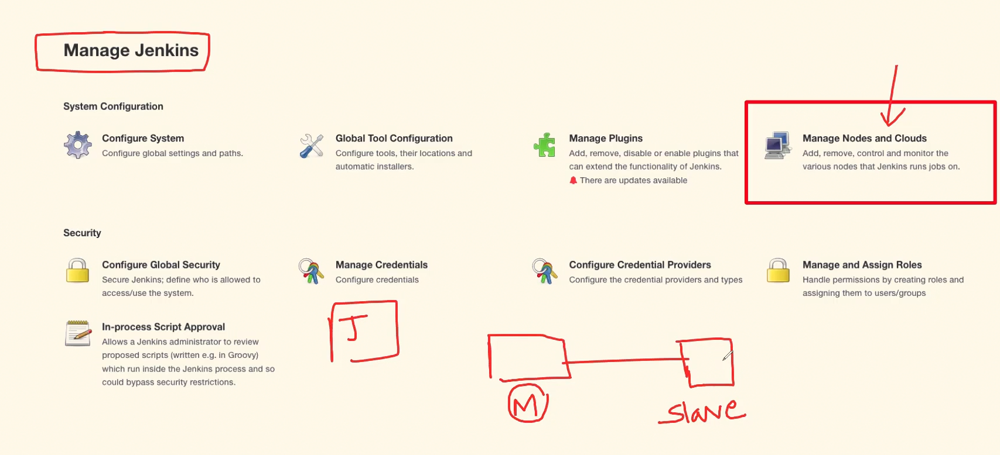

## Q. Have you use Jenkins in multinode setup? If yes, could you explain how to add a new slave/follower to the master?

### Answer:

-   Yes, I have used Jenkins multi-node setup, because it offers me a high availability for our production pipelines. 

-   To add Jenkins slaves to master, I would
    1. Login to Jenkins
    2. Go to Manage Jenkins
    3. In System Configuration, Manage Nodes 
    
