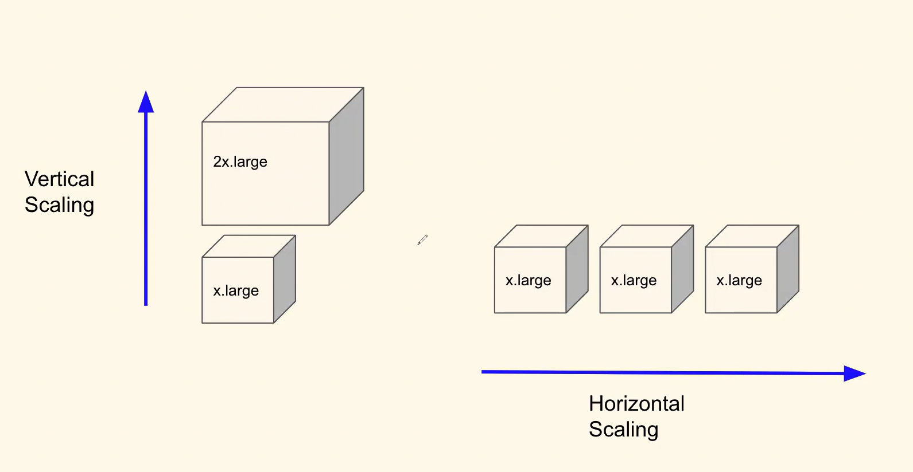

## Q. What is vertical Scaling and horizontal Scaling? Explain with use-case that you have seen?

### Answer:

-   Vertical Scaling and Horizontal Scaling, both are important methologies that we implement when we want to scale our application.
    -   The use of vertical scaling will appear when we add more features to our application which might need more CPU,RAM for processing requests.

    -   The use of horizontal scaling will appear when there is incomming traffic spike. (ASG=Auto Scaling Group)