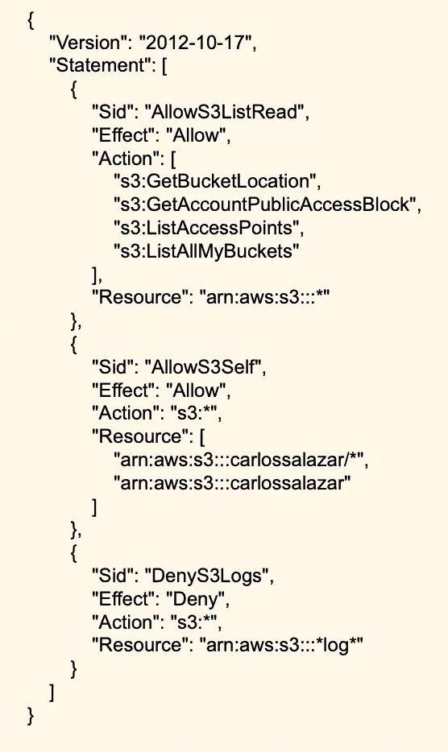

## Q. Explain the below IAM policy?

### Answer:

-   This policy has 3 major high level actions
    -   2 are to allow and 1 is to deny

-   In the first section, ***specific* read actions are allowed *for all S3 Buckets***

-   In the second section, **allow *all* action to specific S3 Bucket.**

-   In the third section, **we are *denying all action* to all buckets if the prefix ends with `.log`**