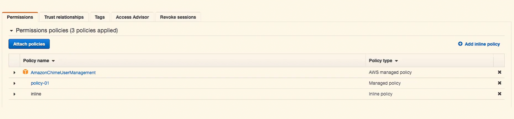

## Why do we have 3 different kinds of IAM policy? (Managed, Customer Managed, In-line)

### Answer:

-   All these 3 kinds of policy play an important role
    1. **Managed Policy:** AWS created and maintained policy
    2. **Customer Managed:** Customer created and managed policy
        -   Can be attached to multiple User, Group or Roles
    
    3.  **Inline Policy:** Create and attached directly to IAM User, Group or Role
        -   When we delete the User, Group or Role, the associated **Inline Policy** will also be deleted.
        -   Restricted to only one User, Group or Role

